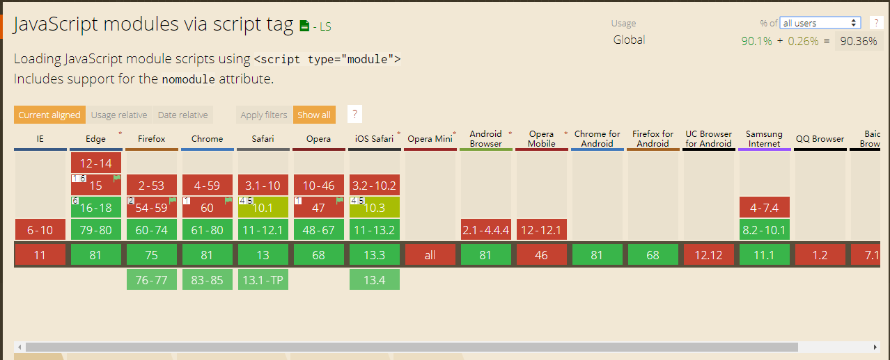

# 探讨不需要打包的构建工具 Snowpack

当谈到前端构建工具，就不得不提的功能强大的 [Webpack](https://www.webpackjs.com/), 尤其是在最新版本中提出了 [Module Federation](https://indepth.dev/webpack-5-module-federation-a-game-changer-in-javascript-architecture/#its-important-to-note-these-are-special-entry-points-they-are-only-a-few-kb-in-size-containing-a-special-webpack-runtime-that-can-interface-with-the-host-it-is-not-a-standard-entry-point--7/) 功能，该功能进一步增强了 Webpack 的实际作用。我相信凭借 Webpack 这几年的积累，恐怕未来几年内没有哪一个打包工具能够与之媲美，但是这并不妨碍我们探讨一下新的工具 [Snowpack](https://www.snowpack.dev/)。

## 现代打包工具的问题

使用 Snowpack，当您构建现代的 Web 应用程序（使用React，Vue等），无需使用类似于 Webpack，Parcel 和 Rollup  等打包工具。每次您点击保存时，都无需等待打包程序重新构建。相反，所有的文件更改都会立即反映在浏览器中。

请关注立即这个词语,  bundleless ? 这个究竟有什么意义？为什么我会这么重点关注这一个工具。

对于一些项目与开发者而言，可能对此没有太大的感触，但是对于我来说，开发中打包曾经是一个噩梦。几年前，我从头开发一个前端 Sass 项目，该项目开始时候就使用 Vue 以 Webpack 根据业务线构建多页面。几个月的时间过去，模块有了十几个。当我修改一个很小的地方时候，需要近一分钟的时候才能热更新完成。当时，我们只能在项目开启的时候设置那些页面需要编译。在忍受了一周后，我们不得不开始拆分项目，因为开发人员和项目开发效率的原因，我们不可能根据业务拆分项目。我们只能把项目中改动较少的的基础服务以及封装的业务组件给提取出去。利用 Webpack 的 externals 来辅助开发。这个方案很好的解决了项目当时的痛点。同时，这件事也让我对于模块划分和性能优化有了一定的认识和见解。

所以，在我看来，bundleless 解决了大部分前端开发者 的一大痛点，就是[心流]([https://baike.baidu.com/item/%E5%BF%83%E6%B5%81/9824097?fr=aladdin](https://baike.baidu.com/item/心流/9824097?fr=aladdin))。当一个程序员被打搅后，他需要 10 - 15 分钟的时间才能重新恢复到之前的编程状态。当你在完成一小块功能时候，想要去查看结果时候，发现当前的项目还在构建状态，这个时候很有可能就会中止心流。

当然，还有一些高明的程序员是完成整块功能再去查看结果。同时开发的 bug 也非常少。该工具对于此类程序员的帮助也不大。谈到这里，我很想要多说两句，虽然程序员在开发中需要学习和使用大量的工具辅助开发，事实上很多工具也确实能够提升效率，但是有时候需要逼自己一把，把自己置身于资源不那么足够的情况下，因为只有这样才能真正的提升能力。这里我推荐一篇博客 [断点单步跟踪是一种低效的调试方法](https://blog.codingnow.com/2018/05/ineffective_debugger.html)，不管大家是认可还是否认，我认为都可以从这篇博客中得到思考。

## 前端项目的演进

就目前成熟的前端框架来说，都会提供一套脚手架工具以便用户使用。之前我们也是把项目直接从 Webpack 转到了 Vue Cli 3。因为 Vue Cli 3 内部封装了 Webpack, 基本上在开发中已经不需要进行 Webpack 基础性配置，同时我们所需要的依赖项目也大大减少了，底层的依赖升级也转移到了 Vue Cli 上，这也变相的减少了很多的开发量。

在探讨 Snowpack 这个新的构建工具之前，我要抛出一个问题，我们究竟为什么要使用 Webpack? 

一个当然是因为 Webpack 确实提供了很多高效有用的工程实践为前端开发者赋能。如果让我们自行研究与使用，需要投入的时间以及掌握的知识远远高于配置学习成本。第二个就是因为它本身是一个静态的 JavaScript 应用程序的静态模块打包工具，首要的重点就在于工具为前端提供了模块与打包。

当年的 JavaScript 设计之初为了保持简单，缺少其他通用语言都具有的模块特性。而该特性正是组织大型，复杂的项目所必须的。但当年的 JavaScript 的工作就是实现简单的提交表单，寥寥几行代码即可实现功能。即使 Ajax 标志 Web 2.0 时代的到来阶段，前端开发的重点还是放在减少全局变量上，于是我们开始使用 IIFE（立即调用函数表达式）来减少全局变量的污染, 而 IIFE 方法存在的问题是没有明确的依赖关系树。开发人员必须以准确的顺序来组织文件列表，以保证模块之间的依赖关系。由于当时网页短暂的生命周期以及后端渲染机制保证了网页的依赖是可控的。

在之后，Node.js 出世，让 JavaScript 可以开发后端，在 Node.js 的许多创新中，值得一提的是 CommonJS 模块系统，或者简称为CJS。 利用 Node.js 程序可以访问文件系统的事实，CommonJS 标准更具有传统的模块加载机制。 在 CommonJS 中，每个文件都是一个模块，具有自己的作用域和上下文。当然，虽然这种机制也底层来自也来自于  IIFE（立即调用函数表达式）。这种创新的爆发不仅来自创造力，还来自于自于必要性：当应用程序变得越来越复杂。 控制代码间的依赖关系越来遇难，可维护性也越来越差。我们需要模块系统以适应那些扩展以及变更的需求，然后围绕它们的生态系统将开发出更好的工具，更好的库，更好的编码实践，体系结构，标准以及模式。终于，伴随模块系统的实现，JavaScript 终于具有了开发大型复杂项目的可能性。

虽然在此之后开发了各式各样的模块加载机制,诸如 AMD UMD 等，但是等到 ES6 的到来。JavaScript 才正式拥有了自己的模块，通常称为ECMAScript模块（ESM）。也是 SnowPack 依赖的基础,这一点我们后面展开来说。

相比于CommonJS ， ES 模块是官方标准，也是 JavaScript 语言明确的发展方向，而 CommonJS 模块是一种特殊的传统格式，在 ESM 被提出之前做为暂时的解决方案。 ESM 允许进行静态分析，从而实现像 tree-shaking 的优化，并提供诸如循环引用和动态绑定等高级功能。同时在 Node v8.5.0 之后也可以在实现标准的情况下使用 ESM，随着Node 13.9.0 版本的发布，ESM 已经可以在没有实验性标志的情况下使用。

Webpack 一方面解决了前端构建大型项目的问题，另一方面提供了插件优化 Web 前端性能。例如从资源合并以及压缩上解决了 HTTP 请求过程的问题，把小图片打包为 base64 以减少请求量，提供 Tree-Shaking 以及动态导入。伴随着 HTTP 协议的升级以及网速的不断加快，我也希望日后这些工作慢慢变成负担。

## ESM (ecmascript module) 已经到来

SnowPack 是基于 ESM 的工具。想要通过一次安装来替换每次更改时候重建的构建步骤。ESM 现在可以在浏览器中使用了! 我们可以使用 [Can i use]()了解一下 ESM 的可以使用性。



可以看到，基本上现代浏览器都已经提供了支持，事实上我们也不需要等到所有的浏览器提供支持。

我们不需要为所有浏览器提供一致性的体验，我们也做不到这一点。事实上，我们在这件事情上是可以做到渐进增强的。对于不支持的浏览器，完全无法理解该语句，也不会去 js 加载。例如可以提供页面预加载的前端库 [instant.page](https://instant.page/)。该库在不支持 ESM 的浏览器上压根不会执行。

同时对于暂时不支持的浏览器来说，依然可以加载 js ，唯一需要做的就是为不支持 <script type="module"> 的浏览器提供一个降级方案。。正如下面的代码，在现代浏览器中，会加载 module.mjs，同时现代浏览器会忽略携带 nomodule 的js。而在之前的浏览器会加载后面的 js 文件。如果你想进一步阅读的话，可以参考 [ECMAScript modules in browsers](https://jakearchibald.com/2017/es-modules-in-browsers/) 。

```html
<script type="module" src="module.mjs"></script>
<script nomodule src="fallback.js"></script>
```

同时，我们可以通过 type="module" 来判断出现代的浏览器。而支持type="module" 的浏览器都支持你所熟知的大部分 ES6 语法,通过这个特性，我们可以打包出两种代码，为现代浏览器提供新的代码，而为不支持 ESM 的浏览器提供另一套代码， 具体可以参考 [Phillip Walton 精彩的博文](https://philipwalton.com/articles/deploying-es2015-code-in-production-today/),这里也有翻译版本 [如何在生产环境中部署ES2015+](https://jdc.jd.com/archives/4911)。如果当前项目已经开始从 webpack 阵营转到 Vue CLI 阵营的话，那么恭喜你，上述解决方案已经被内置到 Vue CLI 当中去了。只需要使用如下指令，项目便会产生两个版本的包。具体可以参考 [Vue CLI 现代模式](https://cli.vuejs.org/zh/guide/browser-compatibility.html#现代模式)。

## Snowpack 解决了什么？

出于对主流浏览器的判断，SnowPack 大胆采用 ESM，其原理也很简单，内部帮助我们将  node_modules  的代码整理并且安装到 一个叫做 web_modules 的文件夹中，需要的时候直接到该文件夹中引入即可。其目标也是为了解决第三方代码的引入问题。(注明: 安装 Snowpack 需要 node v10.17.0 以上版本)

当然，如果仅仅只为了解决第三方引入的问题，事实上我们自己也可以手动解决，但是面对错综复杂的第三方库，我们自己通过 node 来构建未免有些过于复杂。同时，该工具依然会提供使用 TypeScript 以及 Babel 的方案 ,同时也为我们提供了少量的配置选项来帮助我们管理第三方依赖。同时，Snowpack 还可以通过 --nomodule 支持旧版浏览器。同时它也可以根据当前引入的模块来自动构建依赖。

当浏览器本身已经开始支持模块，如果网络速度已经不再是限制，那么我们是否应该离开复杂的构建环境转向简单的代码? 答案是肯定的，简单的方案一定会赢得开发者的青睐。

说到这里，我不禁想到当年刚刚学习软件时侯总是遇到 BS (浏览器与服务器)架构和 CS (客户端与服务器) 架构的问题与选择。历史的选择告诉我们，能够使用 BS 架构的软件，一定会用 BS 架构。如果桌面端的 CS 转向 BS 是一条漫长的探索之路，那么移动端的 CS 转向 BS 则是必经之路。

对于 Vue 这种渐进式的框架来说，即使没有打包工具，我们依然可以在 html 中直接引入开发，而对于 React, Svelte 这些需要编译才能够使用的库来说，SnowPack 也提供了方案来帮助我们协作解决。对于 css 图片这些，浏览器不支持用 js 导入，我们还需要为其改造，具体的实现可以直接学习 [Snowpack 官网](https://www.snowpack.dev/) 以及 [Snowpack 例子](https://github.com/pikapkg/snowpack#examples)。

说了 Snowpack 的优势，我们也必须聊一聊 Snowpack 的劣势。过于激进一定是劣势，毕竟不支持 ESM 的库还是很多，面对企业应用开发，我们还是需要稳定的工具。同时面对强大脚手架工具，过于捉襟见肘，需要付出更大的精力来维持系统的一致性。同时，在浏览器使用模块化之后，前端代码更容易被分析，这个是否会影响项目本身，事实上也有待商榷。没有模块热更新功能，这点令开发很痛苦。

## 题外话 vite

前两天，Vue3 beta 版本出世，在直播中，Vue 开发者尤雨溪也是顺带说了一下为 Vue 3 提供的“小”工具 [vite](https://github.com/vuejs/vite) ,我在闲暇之时也是去把玩了一下。该工具也是根据浏览器 ESM 结合 node 来针对每个更改模块进行即时编译后直接提供给浏览器。 也就是说，当你在开发中修改了某个 vue 文件之后，node 会编译该文件并且通过 HMR 提供给浏览器当前编译后的 vue 文件。

相对比 Snowpack 来说，该方案则更加优美 (个人感觉)。同时兼顾了开发和生产环境。虽然在当前阶段还不能投入生产，但是我相信 vite 在未来会大放光芒。

## 展望

前几年，我们需要 Webpack 配置工程师，随着 [Parcel](https://parceljs.org/) 的发布, Webpack 随后也提供了零配置，伴随着依赖升级的复杂度一步步变高，各个框架也是将 Webpack 作为自己的依赖提供更优的工具，伴随着 bundleless。我们可以看到，前端开发难度降低的同时体验也在提升，这是一件好事。

同时，云端 Serverless 架构也降低了创业公司对基础建设的需求。也许将来真的会有业务人员投入到开发中来。而我们也有更多的时间投入到业务场景与业务需求中去。

[Snowpack 官网](https://www.snowpack.dev/) 

[Vue CLI 现代模式](https://cli.vuejs.org/zh/guide/browser-compatibility.html#现代模式)

[如何在生产环境中部署ES2015+](https://jdc.jd.com/archives/4911)

[snowpack，提高10倍打包速度](https://zhuanlan.zhihu.com/p/108222057)

 [断点单步跟踪是一种低效的调试方法](https://blog.codingnow.com/2018/05/ineffective_debugger.html)

[vite](https://github.com/vuejs/vite)