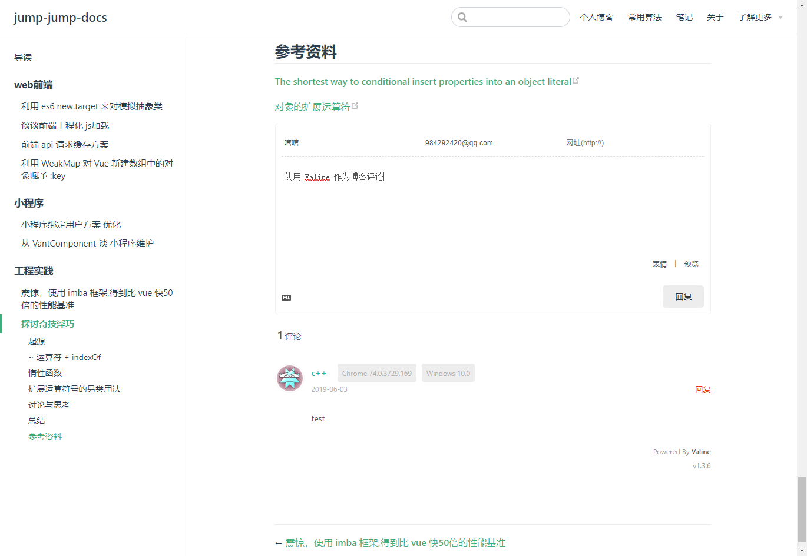
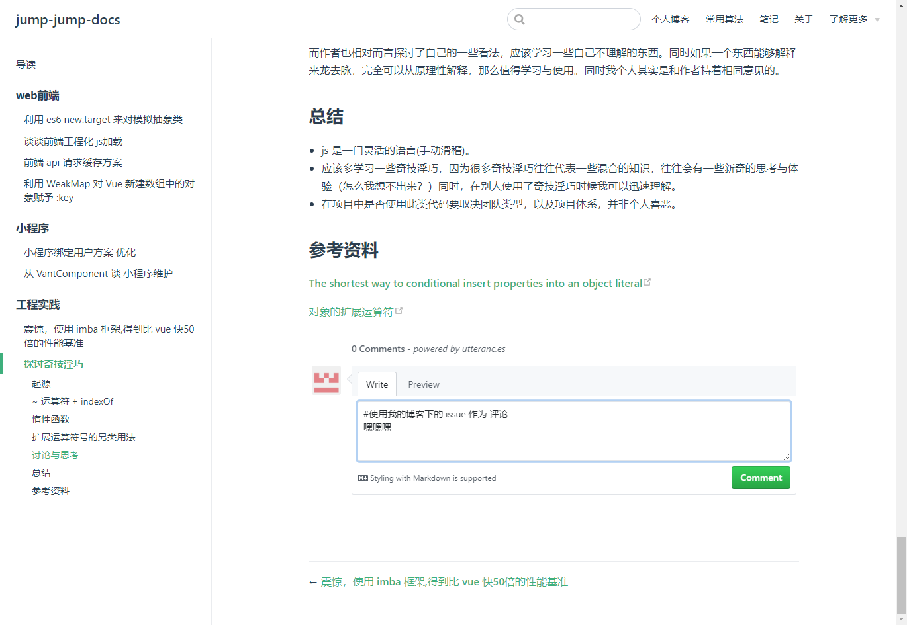
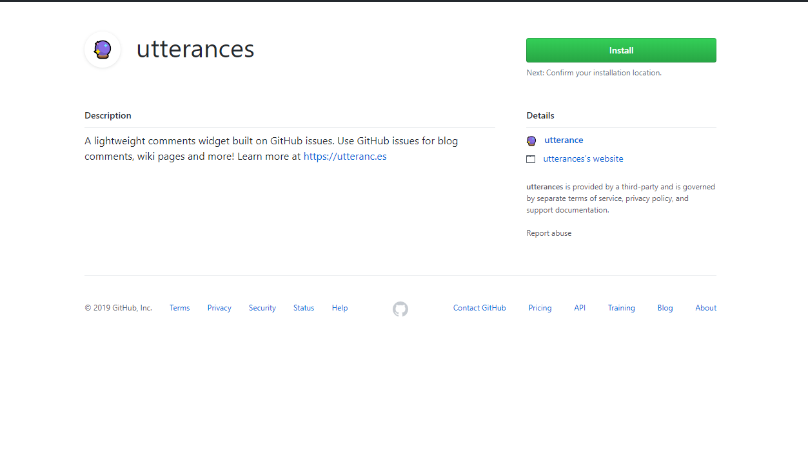
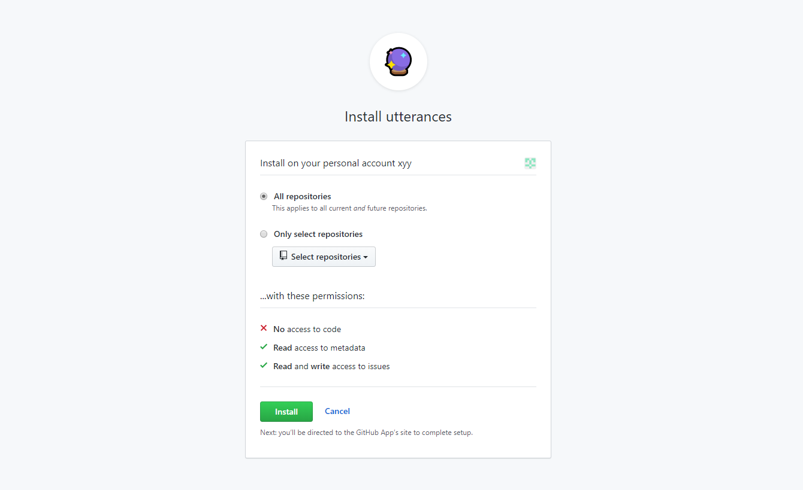
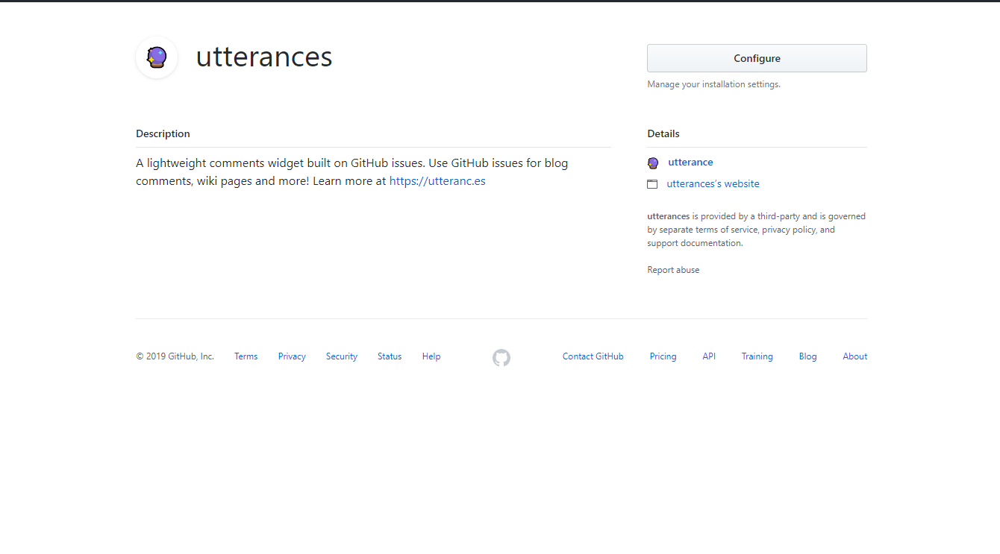
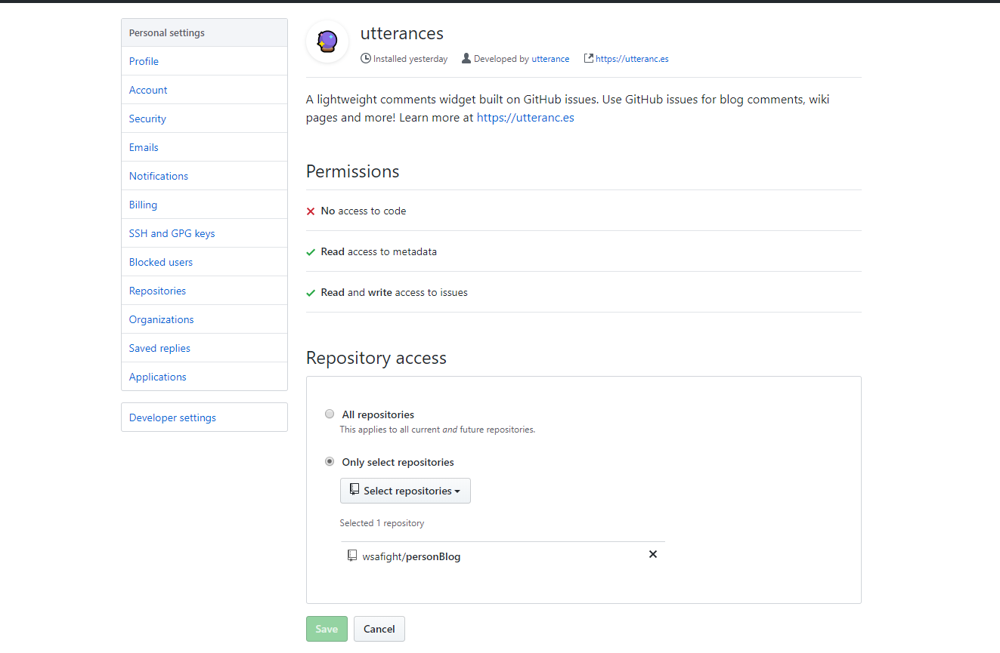

# 手把手教你使用issue作为博客评论——utterances

自从上周在阮一峰的 [每周分享第 60 期](http://www.ruanyifeng.com/blog/2019/06/weekly-issue-60.html) 看到了可以将 GitHub 的 issue 当作评论系统，插入第三方网页的 JS 库——[utterances](https://utteranc.es/)。我就对此“魂牵梦绕”。个人博客使用的是[VuePress](https://vuepress.vuejs.org/zh/)。  

## TLDR (不多废话，先看效果)

之前是使用了 Valine 作为博客的评论系统。



下图是改为 utterances 风格。



## utterances 介绍及使用
utterances 是基于github issue，拥有多种主题的开源免费小组件。

1.首先我们所需要的 github 存储库必须是公开的，而不是私有的，这样我们的读者才可以查看以及发表评论。

2.我们必须在 github 上进行安装 utterances,首先我们访问 [utterances应用程序](https://github.com/apps/utterances) 然后点击 Install 按钮进行安装。


3.在这里可以选择可以关联的存储库，可以选择我们所拥有的库(也包括未来建立的库)或者某一个仓库，这里我们只选择某一个需要进行评论的库，这样比较好。


4.安装完成即可，随后我们访问[utterances应用程序](https://github.com/apps/utterances)就不再是安装而是是执行配置项目。





5.此时服务端配置已经完成，现在我们可以进行客户端的操作，也就是 blog 端。在blog端我们只需要添加以下这段脚本就可以直接运行。

```
<script 
// 加载的客户端脚本
    src="https://utteranc.es/client.js"
// repo 就是访问的仓库，格式 用户名/仓库名
// 个人就是 repo="wsafight/personBlog"
        repo="[ENTER REPO HERE]"

// 选定的当前blog 与 issue 之间的关系
// 个人使用的是不会自动创建的 issue-number，每个issue都有自己的number。该选项是使用特定的issue
        issue-term="pathname"
// 主题为  github-light 还有其他主题可以选择        
        theme="github-light"
        crossorigin="anonymous"
        async>
</script>
```

6.因为我的博客是采用 [VuePress](https://vuepress.vuejs.org/zh/),所以在 markdown 中是无法使用 script 脚本的。我们就需要编写写一个 vue 组件。(组件的文件路径为 [blog name]/.vuepress/components/)
```
// Utterances 组件
<template>
    <div id="comment"></div>
</template>
<script>
export default {
  name: 'Utterances',
  props: {
    // 传入的 issue-number  
    id: Number
  },
  methods: {
    initValine () {
        // 建立脚本以及属性
        const utterances = document.createElement('script');
        utterances.type = 'text/javascript';
        utterances.async = true;
        utterances.setAttribute('issue-number', this.id)
        utterances.setAttribute('theme','github-light')
        utterances.setAttribute('repo',`wsafight/personBlog`)
        utterances.crossorigin = 'anonymous';
        utterances.src = 'https://utteranc.es/client.js';

        // comment 是要插入评论的地方
        window.document.getElementById('comment').appendChild(utterances);

    }
  },
  mounted: function(){
    // 每次挂载时候，进行初始化
    this.initValine()
  }
}
</script>
```

7.最后。在 md 文档中直接使用上面编写的组件

```
## 参考资料
[高性能JS-DOM](https://www.cnblogs.com/libin-1/p/6376026.html)   
[imba 性能篇](http://imba.io/guides/advanced/performance)

// 可以在 md 文档中直接使用组件
<Utterances :id="8"/>
```

## utterances其他配置项
主题 Theme 选项如下,我们可以选择各色主题：   

- Github Light
- Github Dark
- Github Dark Orange
- Icy Dark
- Dark Blue
- Photon Dark

评论 issue-term 映射配置选项如下：

- pathname
- url
- title   
- og:title
- issue-number   
issue-term="1"   
特定number的issue，不会自动创建，个人使用该方案
- specific-term 

## 参考文档
[utteranc 文档](https://utteranc.es/)   
[博客使用 utterances 作为评论系统](https://www.cnblogs.com/stevexu/p/10808134.html)